# 🏛️ SPCMS: Professional Visual Technical Approach

<div align="center">

## 🎯 Smart Pilgrimage Crowd Management System
### 📋 **Problem Statement ID: 25165**
### 🛕 **Temple & Pilgrimage Crowd Management**
#### *Somnath • Dwarka • Ambaji • Pavagadh*

**Organization:** Government of Gujarat  
**Department:** Gujarat Council on Science & Technology (GUJCOST)  
**Theme:** Heritage & Culture  
**Category:** Software


</div>

---

## 📊 Technical Approach Overview

<div align="center">

```mermaid
graph TB
    subgraph "🏛️ SPCMS TECHNICAL ARCHITECTURE"
        A[👥 Pilgrims<br/>Mobile App<br/>Web Portal<br/>Kiosks] --> B[🌐 API Gateway<br/>Authentication<br/>Load Balancing<br/>Rate Limiting]
        C[🏛️ Authorities<br/>Dashboard<br/>Analytics<br/>Alerts] --> B
        D[👨‍💼 Volunteers<br/>Staff App<br/>Communication<br/>Maps] --> B
        
        B --> E[⚙️ Microservices Layer<br/>User Service | Queue Service<br/>Map Service | Alert Service<br/>Language Service | Payment Service]
        
        E --> F[🗄️ Database<br/>PostgreSQL<br/>MongoDB<br/>Redis Cache<br/>InfluxDB]
        E --> G[🤖 AI/ML Engine<br/>Prediction Models<br/>Analytics<br/>Detection<br/>Forecasting]
        E --> H[📡 IoT Layer<br/>CCTV Cameras<br/>Sensors<br/>Drones<br/>Beacons]
        
        H --> I[🛕 Temple Sites<br/>Somnath<br/>Dwarka<br/>Ambaji<br/>Pavagadh]
    end
    
    style A fill:#e1f5fe
    style B fill:#f3e5f5
    style C fill:#e8f5e8
    style D fill:#fff3e0
    style E fill:#fce4ec
    style F fill:#e0f2f1
    style G fill:#fff8e1
    style H fill:#e3f2fd
    style I fill:#f1f8e9
```

</div>

---

## 🔄 Data Flow Architecture

```mermaid
flowchart LR
    subgraph "📥 INPUT SOURCES"
        A1[📹 CCTV Feeds]
        A2[📡 IoT Sensors]
        A3[🚁 Drones]
        A4[📱 Mobile Apps]
        A5[📅 Festival Calendar]
        A6[🌤️ Weather Data]
    end
    
    subgraph "⚡ PROCESSING LAYER"
        B1[🔄 Stream Processing]
        B2[🗄️ Data Storage]
        B3[🔍 Data Validation]
        B4[🧹 Data Cleaning]
        B5[📦 Aggregation]
    end
    
    subgraph "🧠 AI/ML ANALYSIS"
        C1[🤖 Prediction Models]
        C2[📊 Analytics Engine]
        C3[🚨 Anomaly Detection]
        C4[📈 Trend Analysis]
        C5[🔮 Forecasting]
    end
    
    subgraph "📤 OUTPUTS"
        D1[📱 Mobile Notifications]
        D2[🖥️ Admin Dashboard]
        D3[🚨 Emergency Alerts]
        D4[🎟️ Queue Management]
        D5[🗺️ Navigation Updates]
    end
    
    A1 & A2 & A3 & A4 & A5 & A6 --> B1 & B2 & B3 & B4 & B5
    B1 & B2 & B3 & B4 & B5 --> C1 & C2 & C3 & C4 & C5
    C1 & C2 & C3 & C4 & C5 --> D1 & D2 & D3 & D4 & D5
    
    style A1 fill:#e3f2fd
    style A2 fill:#e8f5e8
    style A3 fill:#fff3e0
    style A4 fill:#fce4ec
    style A5 fill:#f3e5f5
    style A6 fill:#e0f2f1
```

<div align="center">



</div>

---

## 💻 Technology Stack

<div align="center">

### 🛠️ SPCMS Technology Stack

| **Layer** | **Technologies** | **Purpose** |
|-----------|------------------|-------------|
| **📱 Frontend** |    | Cross-platform mobile & web apps |
| **🌠API Gateway** |   | Authentication, rate limiting, security |
| **⚙️ Backend** |    | Microservices, APIs, business logic |
| **🗄️ Database** |    | Data persistence, caching |
| **🤖 AI/ML** |    | Predictive analytics, computer vision |
| **☁️ Infrastructure** |    | Cloud deployment, containerization |

</div>

---

## 📡 IoT & Sensor Network

<div align="center">


</div>

---

## 🚀 Implementation Roadmap

<div align="center">


</div>

---

## 🔒 Security Architecture

```mermaid
graph TB
    subgraph "🛡️ MULTI-LAYERED SECURITY"
        subgraph "🔥 Layer 1: Perimeter Security"
            L1A[🔥 WAF Firewall]
            L1B[🛡️ DDoS Protection]
            L1C[🌐 CDN Security]
            L1D[🔒 VPN Access]
        end
        
        subgraph "🔐 Layer 2: Application Security"
            L2A[🔐 JWT Tokens]
            L2B[🔑 OAuth 2.0]
            L2C[📊 Rate Limiting]
            L2D[✅ Input Validation]
        end
        
        subgraph "🔒 Layer 3: Data Security"
            L3A[🔒 AES Encryption]
            L3B[🗄️ Database Security]
            L3C[🔐 Key Management]
            L3D[📝 Audit Logs]
        end
        
        subgraph "☁️ Layer 4: Infrastructure Security"
            L4A[☁️ Cloud Security]
            L4B[🐳 Container Security]
            L4C[📊 Monitoring]
            L4D[🚨 SIEM/SOC]
        end
    end
    
    L1A & L1B & L1C & L1D --> L2A & L2B & L2C & L2D
    L2A & L2B & L2C & L2D --> L3A & L3B & L3C & L3D
    L3A & L3B & L3C & L3D --> L4A & L4B & L4C & L4D
    
    style L1A fill:#ffebee
    style L1B fill:#ffebee
    style L1C fill:#ffebee
    style L1D fill:#ffebee
    style L2A fill:#e8f5e8
    style L2B fill:#e8f5e8
    style L2C fill:#e8f5e8
    style L2D fill:#e8f5e8
    style L3A fill:#e3f2fd
    style L3B fill:#e3f2fd
    style L3C fill:#e3f2fd
    style L3D fill:#e3f2fd
    style L4A fill:#fff3e0
    style L4B fill:#fff3e0
    style L4C fill:#fff3e0
    style L4D fill:#fff3e0
```

<div align="center">



</div>

---

## 📱 Mobile Application Architecture

```mermaid
graph TB
    subgraph "📱 MOBILE APP ARCHITECTURE"
        subgraph "🎨 UI Layer"
            UI1[📱 React Native]
            UI2[🎨 Material Design]
            UI3[🌐 Multilingual UI]
            UI4[♿ Accessibility]
        end
        
        subgraph "🔄 State Management"
            SM1[🔄 Redux Toolkit]
            SM2[💾 AsyncStorage]
            SM3[🔄 Background Sync]
            SM4[📊 Cache Manager]
        end
        
        subgraph "🚀 Core Features"
            CF1[🎟️ Queue Booking]
            CF2[🗺️ Navigation]
            CF3[🚨 Emergency SOS]
            CF4[📱 Notifications]
            CF5[📊 Real-time Info]
            CF6[👤 User Profile]
        end
        
        subgraph "📱 Device Integration"
            DI1[📍 GPS Location]
            DI2[📷 Camera/QR]
            DI3[🔊 Audio Guide]
            DI4[📳 Haptic Feedback]
            DI5[🔋 Battery Management]
            DI6[📶 Network Status]
        end
        
        subgraph "🌐 API Integration"
            API1[🌐 REST APIs]
            API2[📡 WebSocket]
            API3[🔄 Sync Service]
            API4[🔐 Auth Manager]
        end
    end
    
    UI1 & UI2 & UI3 & UI4 --> SM1 & SM2 & SM3 & SM4
    SM1 & SM2 & SM3 & SM4 --> CF1 & CF2 & CF3 & CF4 & CF5 & CF6
    CF1 & CF2 & CF3 & CF4 & CF5 & CF6 --> DI1 & DI2 & DI3 & DI4 & DI5 & DI6
    DI1 & DI2 & DI3 & DI4 & DI5 & DI6 --> API1 & API2 & API3 & API4
    
    style UI1 fill:#e3f2fd
    style UI2 fill:#e3f2fd
    style UI3 fill:#e3f2fd
    style UI4 fill:#e3f2fd
    style SM1 fill:#e8f5e8
    style SM2 fill:#e8f5e8
    style SM3 fill:#e8f5e8
    style SM4 fill:#e8f5e8
    style CF1 fill:#fff3e0
    style CF2 fill:#fff3e0
    style CF3 fill:#fff3e0
    style CF4 fill:#fff3e0
    style CF5 fill:#fff3e0
    style CF6 fill:#fff3e0
```

<div align="center">



</div>

---

## 🤖 AI/ML Pipeline

```mermaid
flowchart TD
    subgraph "📥 DATA SOURCES"
        DS1[📹 CCTV Feeds<br/>4K Video Streams]
        DS2[📡 IoT Sensors<br/>Real-time Telemetry]
        DS3[📱 Mobile Data<br/>User Interactions]
        DS4[📅 Calendar Data<br/>Festivals & Events]
        DS5[🌤️ Weather Data<br/>API Integration]
    end
    
    subgraph "🧹 PREPROCESSING"
        PP1[🧹 Data Cleaning<br/>Noise Removal]
        PP2[🔄 Transformation<br/>Normalization]
        PP3[📊 Feature Engineering<br/>Time Series Features]
        PP4[🔍 Data Validation<br/>Quality Checks]
    end
    
    subgraph "🤖 ML MODELS"
        ML1[📈 Time Series<br/>LSTM, ARIMA, Prophet]
        ML2[🔍 Anomaly Detection<br/>Isolation Forest]
        ML3[👥 Crowd Density<br/>Computer Vision, YOLO]
        ML4[🎯 Classification<br/>Random Forest, SVM]
    end
    
    subgraph "🚀 DEPLOYMENT"
        DP1[🚀 Real-time Inference<br/>TensorFlow Serving]
        DP2[📊 Batch Processing<br/>Scheduled Jobs]
        DP3[🔄 A/B Testing<br/>Model Comparison]
        DP4[📈 Monitoring<br/>Performance Metrics]
    end
    
    subgraph "📤 OUTPUTS"
        OP1[🔮 Crowd Predictions<br/>Peak Hour Forecasts]
        OP2[🚨 Emergency Alerts<br/>Anomaly Detection]
        OP3[📊 Analytics Insights<br/>Trend Analysis]
        OP4[📈 Recommendations<br/>Resource Optimization]
    end
    
    DS1 & DS2 & DS3 & DS4 & DS5 --> PP1 & PP2 & PP3 & PP4
    PP1 & PP2 & PP3 & PP4 --> ML1 & ML2 & ML3 & ML4
    ML1 & ML2 & ML3 & ML4 --> DP1 & DP2 & DP3 & DP4
    DP1 & DP2 & DP3 & DP4 --> OP1 & OP2 & OP3 & OP4
    
    style DS1 fill:#e3f2fd
    style DS2 fill:#e8f5e8
    style DS3 fill:#fce4ec
    style DS4 fill:#f3e5f5
    style DS5 fill:#e0f2f1
    style ML1 fill:#fff8e1
    style ML2 fill:#fff8e1
    style ML3 fill:#fff8e1
    style ML4 fill:#fff8e1
    style OP1 fill:#e8f5e8
    style OP2 fill:#ffebee
    style OP3 fill:#e3f2fd
    style OP4 fill:#f3e5f5
```

<div align="center">



</div>

---

## ☁️ Cloud Deployment Architecture

```mermaid
graph TB
    subgraph "🌐 GLOBAL INFRASTRUCTURE"
        subgraph "🔄 Load Balancer & CDN"
            LB1[🔄 Global Load Balancer]
            CDN1[🌐 Content Delivery Network]
            AS1[⚡ Auto Scaling]
        end
        
        subgraph "🌏 Multi-Region Deployment"
            R1[🌏 Region 1 - Primary<br/>Mumbai, India]
            R2[🌏 Region 2 - Secondary<br/>Delhi, India]
            R3[🌏 Region 3 - DR Site<br/>Bangalore, India]
        end
        
        subgraph "☸️ Kubernetes Orchestration"
            K8S1[☸️ Container Orchestration]
            K8S2[🔄 Auto-healing]
            K8S3[📈 Resource Management]
            K8S4[🔄 Rolling Updates]
        end
        
        subgraph "📊 Monitoring & Observability"
            MON1[📊 Prometheus Metrics]
            MON2[📝 ELK Stack Logging]
            MON3[🚨 Alert Manager]
            MON4[📈 Grafana Dashboards]
        end
    end
    
    LB1 & CDN1 & AS1 --> R1 & R2 & R3
    R1 & R2 & R3 --> K8S1 & K8S2 & K8S3 & K8S4
    K8S1 & K8S2 & K8S3 & K8S4 --> MON1 & MON2 & MON3 & MON4
    
    style LB1 fill:#e3f2fd
    style CDN1 fill:#e3f2fd
    style AS1 fill:#e3f2fd
    style R1 fill:#e8f5e8
    style R2 fill:#fff3e0
    style R3 fill:#ffebee
    style K8S1 fill:#f3e5f5
    style K8S2 fill:#f3e5f5
    style K8S3 fill:#f3e5f5
    style K8S4 fill:#f3e5f5
    style MON1 fill:#e0f2f1
    style MON2 fill:#e0f2f1
    style MON3 fill:#e0f2f1
    style MON4 fill:#e0f2f1
```

<div align="center">



</div>

---

## 📊 Performance Metrics & KPIs

<div align="center">

### 🎯 Key Performance Indicators

| **Phase** | **Metric** | **Target** | **Current Status** |
|-----------|------------|------------|-------------------|
| **Phase 1** | API Response Time | < 2 seconds |  |
| **Phase 2** | AI Prediction Accuracy | > 85% |  |
| **Phase 3** | System Availability | 99.9% |  |
| **Phase 4** | User Satisfaction | > 90% |  |

### 📈 Development Progress

| **Component** | **Completion** | **Status** |
|---------------|----------------|------------|
| **Backend APIs** |  | ✅ In Progress |
| **Mobile App** |  | 🔄 Active Development |
| **AI/ML Models** |  | 🧠 Training Phase |
| **IoT Integration** |  | 📡 Planning Phase |
| **Security Implementation** |  | 🔒 Nearly Complete |

</div>

---

## 🎨 Presentation Guidelines

### 📊 Professional Slide Design

<div align="center">

#### 🎯 Color Palette


#### 📱 Typography
- **Headers**: Roboto Bold, 24-32pt
- **Subheaders**: Roboto Medium, 18-24pt
- **Body Text**: Roboto Regular, 14-16pt
- **Code**: Fira Code, 12-14pt

</div>

### 🏆 Key Presentation Strengths

<div align="center">

| **Strength** | **Description** | **Impact** |
|--------------|-----------------|------------|
| **🔧 Technical Depth** | Comprehensive system architecture |  |
| **📈 Scalability** | Nationwide deployment ready |  |
| **🛡️ Security** | Enterprise-grade protection |  |
| **🤖 Innovation** | AI/ML powered intelligence |  |
| **📱 User Experience** | Mobile-first, accessible design |  |
| **🌠Integration** | Complete IoT ecosystem |  |

</div>

---

## 🎯 Conclusion

<div align="center">

### 🙏 **Blending Tradition with Technology for Safer Pilgrimages**

The **SPCMS Technical Approach** represents a comprehensive, modern, and scalable solution that combines:

- **🏗️ Robust Architecture**: Microservices-based, cloud-native design
- **🤖 Intelligent Systems**: AI/ML powered predictive analytics  
- **📱 User-Centric Design**: Mobile-first, accessible interfaces
- **🔒 Enterprise Security**: Multi-layered protection framework
- **🚀 Scalable Implementation**: Phased rollout with clear milestones

**Ready for SIH 2025 Presentation & Real-World Implementation**

---


*© 2025 SPCMS Technical Team | Smart India Hackathon*

</div>
